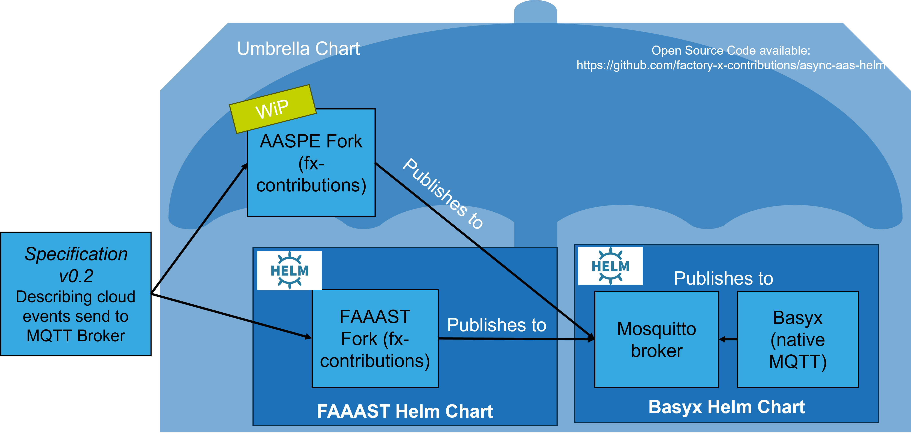

# AAS over MQTT

This repository contains material to discuss the current state of asynchronous communication with Asset Administration
Shell payloads. IDTA 01002-3-1 does not specify anything to this regard which is a major inhibitor for use-cases that
require low-overhead, high-veracity messaging. To serve such use-cases in the Factory-X project, this repository hosts
various resources.

1. Runnable Helm Chart

This repo is an umbrella helm chart that demonstrates interoperation (or lack thereof) between multiple 
AAS-implementations. Currently, it hosts two helm dependency charts. One for the FAAAST and one for Eclipse Basyx. The 
latter hosts an MQTT broker. The Basyx helm chart is largely copied from upstream - only the values are different. Once 
these open source projects expose their own helm repositories, the entire `charts` folder will be removed.

2. Specification Documents

In order to provide implementations with an abstract spec document that they can use to implement, the `specs`
folder contains a set of [asyncAPI](https://www.asyncapi.com/) files that describe in a transport-agnostic manner the
payload and topic structure for AAS messages. There's a human-readable spec [deployed via github pages](https://factory-x-contributions.github.io/async-aas-helm).
The sources can be found on [Github](specs).

3. MongoDB Install

helm install -n basyx mongodb bitnami/mongodb --version 16.5.45 -f values.mongodb.yaml
