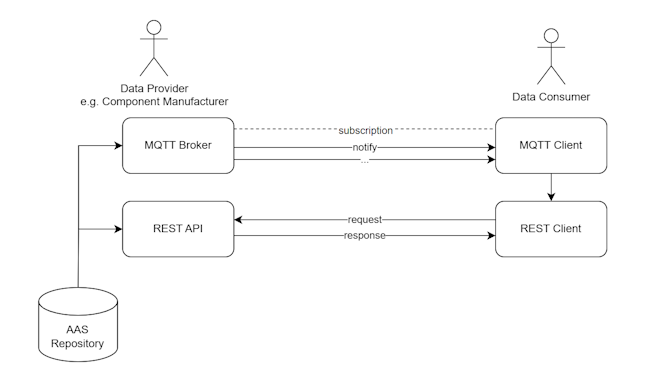

## Specification for Messaging with the Asset Administration Shell

# Introduction
The aim of this specification is to define a messaging mechanism through which changes to asset administration shells (AASs), submodels and submodel-elements in an AAS repository can be communicated to interested data consumers in near real time.

This specification complements the AAS REST API by introducing a publish-subscribe (pub-sub) mechanism. While the REST API is designed to fulfil the purpose of providing standardized, structured access to data, the pub-sub mechanism complements this by enabling real-time notifications to data consumers. Specifically, it ensures that consumers are immediately informed of any changes to the data in the AAS repository, thereby enhancing responsiveness and eliminating the need for frequent polling/scraping of the repository to discover data updates.

REST-type connections follow a request-response model. The client initiates communication by sending a request to the server, which then responds by sending back the requested data. This means that the client must actively poll the server to receive information. In contrast, publish-subscribe connections are event-driven. Clients subscribe to specific topics, and the broker automatically pushes updates to them whenever relevant data changes.

### Message Semantics

