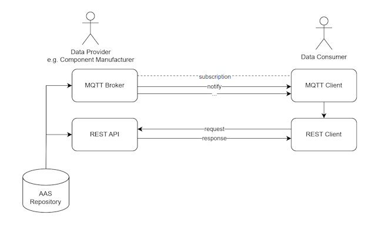

## Specification for Messaging with the Asset Administration Shell

# Introduction
The aim of this specification is to define a messaging mechanism through which changes to asset administration shells (AASs), submodels and submodel-elements in an AAS repository can be communicated to interested data consumers in near real time.

This specification complements the AAS REST API by introducing a publish-subscribe (pub-sub) mechanism. While the REST API is designed to fulfil the purpose of providing standardized, structured access to data, the pub-sub mechanism complements this by enabling real-time notifications to data consumers. Specifically, it ensures that consumers are immediately informed of any changes to the data in the AAS repository, thereby enhancing responsiveness and eliminating the need for frequent polling/scraping of the repository to discover data updates.

REST-type connections follow a request-response model. The client initiates communication by sending a request to the server, which then responds by sending back the requested data. This means that the client must actively poll the server to receive information. In contrast, publish-subscribe connections are event-driven. Clients subscribe to specific topics, and the broker automatically pushes updates to them whenever relevant data changes.



## Normative Disclaimer 
The key words **MUST**, **MUST NOT**, **SHOULD**, **SHOULD NOT**, and **MAY** in this document are to be interpreted as described in RFC 2119.

# Events

Events represent notifications about changes that occur in an AAS repository. 
They are generated whenever the state of an AAS, a Submodel (SM), or a SubmodelElement (SME) changes.

Events allow external systems to observe these changes without continuously polling the repository. 
Instead, subscribers receive notifications through the messaging infrastructure whenever relevant updates occur.

This section clarifies when events should be emitted and how the different event types should be used.

## When Events Should Be Emitted

An implementation MUST emit an event whenever an observable state of the AAS repository changes.

Observable changes include:

- creation of AASs 
- updates to AASs
- deletion of AASs 
- creation of SMs or SMEs
- updates to SMs or SMEs 
- deletion of SMs or SMEs 

An event SHOULD NOT be emitted if an operation does not actually change the stored data.

## Event Types

The messaging model distinguishes several event types that describe the type of change that occurred.

The following event types are used:

- `ElementCreated`
- `ElementDeleted`
- `ElementUpdated`
- `ValueChanged`

The chosen event type should reflect the semantic meaning of the change.

### ElementCreated

`ElementCreated` indicates that a new element was added to the AAS model, e.g., creation of new AAS or adding SME to SME collection.

Example:
```REST
POST /submodels/{id}/submodelElements
```

### ElementDeleted

`ElementDeleted` indicates that an element has been removed from the AAS model, e.g., deleting of a property or deleting SM.

Example:
```REST
DELETE /submodelElements/{id}
```

### ElementUpdated

`ElementUpdated` represents a change to the structure or metadata of an element, e.g., changes to metadata such as the idShort.

Example:
```REST
PATCH /submodelElements/{id}
{
"idShort": "newName"
}
```

### ValueChanged

`ValueChanged` indicates that the value of a data element has changed, e.g., changing the value of a property.

Example: 
```REST 
PATCH /submodelElements/power/value
value = 10
```


